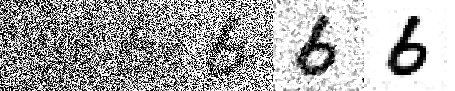

# Пробуем запустить GAN сети в OpenVINO

Репозиторий моделей Open Model Zoo библиотеки OpenVINO содержит большое
количество разных глубоких нейронных сетей. Но нам пока не встретилось GAN
моделей, которые генерировали бы новые данные из шума.



## Совсем немного про GAN сети

Генеративно-состязательные сети (GAN) при хорошем обучении позволяют создавать
изображения, которые будут восприниматься как реальные, а не синтезированные.
GAN сети находят все большее применение в разных задачах:

- составление описания по картинке;
- генерация картинки по описанию;
- создание эмоджи по фотографии;
- увеличение разрешения изображений;
- перенос стиля изображений;
- улучшение качества медицинских изображений;
- генерация лиц и многое-многое другое.

Но для начала потренируемся на ~~кошках~~ цифрах, чтобы удостовериться, что
OpenVINO умеет в GAN сети.

## Генерация изображений цифр с помощью GAN

Сразу замахиваться на styleGAN мы не решили, а для начала обучили небольшую
модельку на Keras, которая будет генерировать цифры, подобные цифрам в наборе
MNIST.
Использование стандартных слоев позволит точно запуститься в OpenVINO и получить
результат даже в том случае, если styleGAN окажется нам не по зубам.
Сетка настолько маленькая и простая, что ее возможно обучать даже на бюджетной
видеокарте NVIDIA своего ноутбука.

Исходный код для обучения и запуска GAN сети по генерации цифр на Keras можно
найти здесь:
[https://github.com/alexmasterdi/Dnn/tree/GAN](https://github.com/alexmasterdi/Dnn/tree/GAN).

Модель, сконвертированная в формат OpenVINO и код для ее запуска в OpenVINO
доступны здесь:
[https://github.com/itlab-vision/OpenVINO-GAN-DEMO](https://github.com/itlab-vision/OpenVINO-GAN-DEMO).
Модель весом всего в 5 мегабайт генерирует вот такие цифры.


## Конвертация модели styleGAN в формат OpenVINO

Конвертацую моделей в формат OpenVINO можно производить из нескольких базовых
форматов: Caffe, Tensorflow, ONNX и т.д. Чтобы запустить модель из PyTorch, мы
сконвертируем ее в ONNX, а из ONNX уже в OpenVINO. Кстати, на практике оказалось,
что конвертацию моделей Keras->ONNX->OpenVINO неподготовленным людям сделать
намного проще, чем Keras->TensorFlow->OpenVINO.

Python код для конвертации Keras модели в ONNX:

```python
import numpy as np
import argparse
import onnx
import keras2onnx
from keras.models import load_model

model = load_model('gan_digits.h5')
onnx_model = keras2onnx.convert_keras(model, model.name)
onnx.save_model(onnx_model, 'gan_digits.onnx')
```

Консольная команда для конвертации ONNX модели в OpenVINO (для Windows)

```cmd
python "C:\Program Files (x86)\IntelSWTools\openvino\deployment_tools\model_optimizer\mo.py" --input_model gan_digits.onnx --input_shape [100,100]
```

После того, как мы сконвертировали модель, нужно реализовать код для запуска
модели в фреймворке OpenVINO.
Простейший последовательный вариант кода выглядит следующим образом:

```python
import numpy as np
import sys
import matplotlib.pyplot as plt
from openvino.inference_engine import IENetwork, IECore

# Инициализируем OpenVINO и загружаем модель
ie = IECore()
net = IENetwork(model='gan_digits_R2020.1.xml', weights='gan_digits_R2020.1.bin')
exec_net = ie.load_network(net, 'CPU')
input_blob = next(iter(net.inputs))
out_blob = next(iter(net.outputs))

# Запускаем инференс для матрицы из шума
noise = np.random.normal(loc=0, scale=1, size=[100, 100])
generated_images = exec_net.infer(inputs={input_blob: noise})

# Показываем результат
generated_images = generated_images['Tanh']
generated_images = generated_images.reshape(100, 28, 28)
figsize = (10, 10)
dim = (10, 10)
plt.figure(figsize=figsize)
for i in range(generated_images.shape[0]):
    plt.subplot(dim[0], dim[1], i + 1)
    plt.imshow(generated_images[i], interpolation='nearest', cmap='gray_r')
    plt.axis('off')
plt.tight_layout()
plt.show()
```

Данный вариант кода будет работать с высокой производительностью, однако все же
не раскроет всей мощи вашего процессора в задаче генерации
лиц. Если же тема производительности заинтересует читателей, мы сделаем
продолжение, в котором разберемся с оптимизацией запуска и утилизацией мощи
процессора на 100%.

## Послесловие

Изначально хотелось в OpenVINO потестировать модели для генерации лиц.
Такие модели содержат большое количество параметров, требуют много памяти и
медленно выполняются на центральном процессоре, а OpenVINO помог бы с их
инференсом.

Наиболее продвинутой моделью генерации лиц, что мне попадались, является
[styleGAN](https://github.com/NVlabs/stylegan).
Результаты и правда впечатляют:


Оригинальная модель styleGAN требует наличия видеокарты от NVIDIA для запуска,
что к сожалению нам не подходит.  
Однако на просторах GitHub была найдена аналогичная модель, которая также
генерирует лица и при этом может работать без GPU -
[https://github.com/rosinality/style-based-gan-pytorch](https://github.com/rosinality/style-based-gan-pytorch?files=1).
Именно ее хотелось взять в качестве модели для конвертации в OpenVINO.

Но наших знаний глубоких сетей оказалось недостаточно, чтобы сконвертировать
PyTorch модель в ONNX формат (тогда мы смогли бы сконвертировать в OpenVINO).
Если у вас есть желание и навыки, чтобы с этим помочь, то мы с радостью дополним
статью!

Коробейников Алексей, Рустамов Азер, Васильев Евгений.
