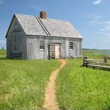
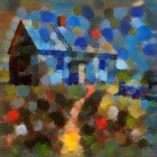

#### Конвертация модели

`python <Директория с openvino>\deployment_tools\model_optimizer\mo.py --input_model <Путь к репозиторию>\sources\models\Pointilism\Pointilism.onnx`

#### Запуск модели

`python <Путь к репозиторию>\sources\models\Pointilism\Pointilism.py --model <Путь к репозиторию>\sources\models\Pointilism\Pointilism.xml --weights <Путь к репозиторию>\sources\models\Pointilism\Pointilism.bin --image <Путь к изображению>`

#### Пример работы модели

